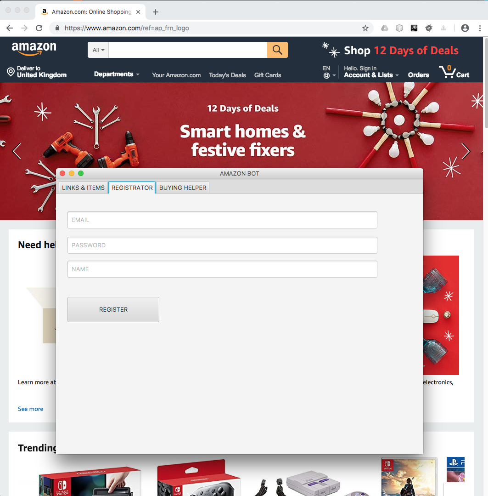
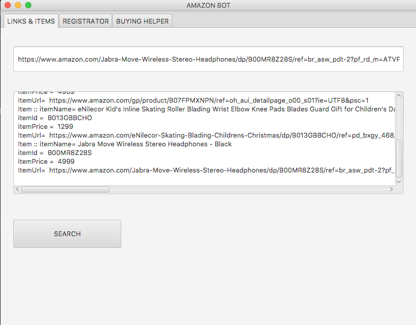
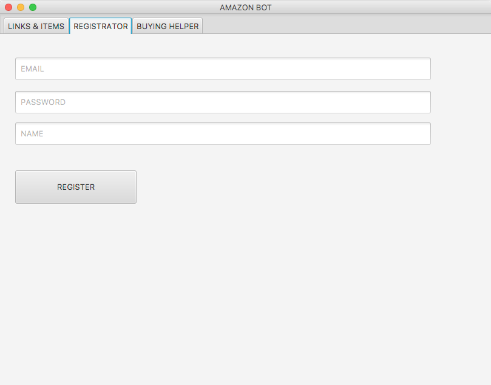
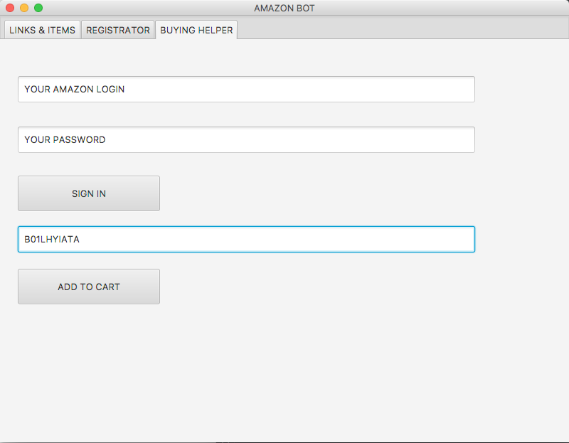

This bot is written with Jsoup, selenium, javafx (sceneBuilder)

It can scrape information from amazon.com

    - input link of the product at amazon.com(e.g https://www.amazon.com/gp/product/B07FPMXNPN/ref=oh_aui_detailpage_o00_s01?ie=UTF8&amp;psc=1)      

    - Bot will scrape the following information and write it into the xml file (amazonItems.xml)
        -   ID
        -   Title
        -   Price
        -   URL
        
Bot can register an account at amazon.con using selenium.

        -   input email (login)
        -   input password
        -   input name
        

Bot can add an item to your cart at amazon.com
        
        -   input item ID

        